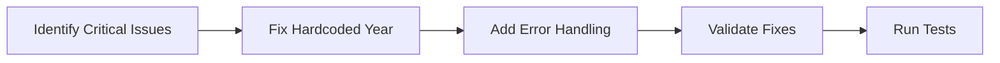
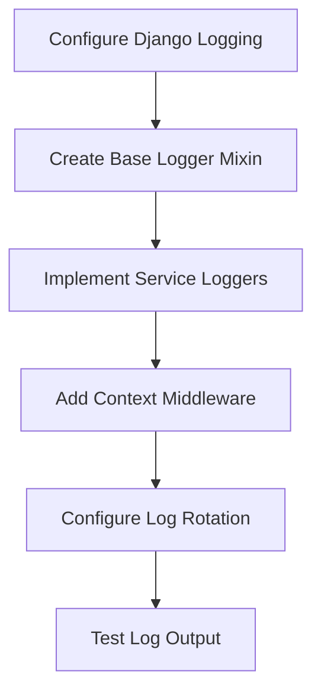
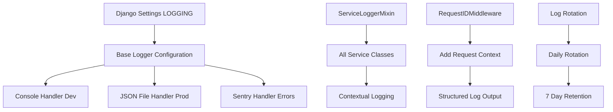
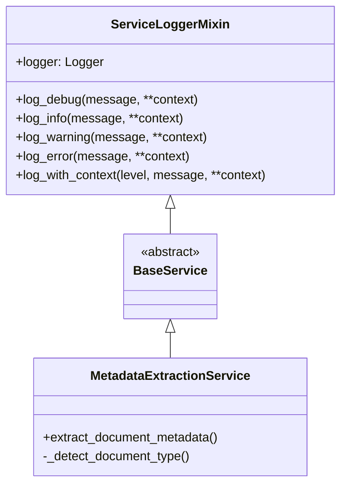
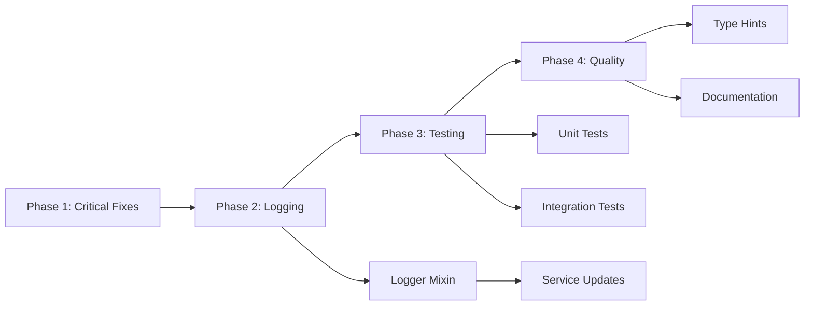

# Code Review Fixes Implementation Plan

**Project:** Thesis Grey - Django Grey Literature Review Platform  
**Date:** 2025-01-26  
**Review:** Code Review #1 (VSA Refactor)

## Executive Summary

This implementation plan addresses all issues identified in Code Review #1, prioritizing critical fixes while establishing sustainable patterns for long-term code quality. The plan focuses on implementing comprehensive logging, fixing critical bugs, improving test coverage, and enhancing code maintainability through type hints and documentation.

## Problem & Solution Overview

### Problem Statement
The recent VSA refactoring introduced excellent architectural improvements but left several critical gaps:
- No logging implementation across 17 new service classes
- Critical bugs including hardcoded year and missing error handling
- Test coverage dropped from ~90% to ~70%
- Missing type hints and documentation in key areas

### Solution Approach
Implement fixes in prioritized phases:
1. **Phase 1**: Critical bug fixes (immediate)
2. **Phase 2**: Logging infrastructure (foundational)
3. **Phase 3**: Test coverage restoration (quality assurance)
4. **Phase 4**: Code quality improvements (maintainability)

## User Stories & Implementation Flow

### Epic: Code Review Remediation

#### Story 1: Critical Bug Fixes
**As a** developer  
**I want** to fix all critical bugs immediately  
**So that** the application functions correctly without runtime errors

**Acceptance Criteria:**
- [ ] Hardcoded year 2024 replaced with dynamic year
- [ ] Error handling added for `get_display_url()` method
- [ ] All critical issues resolved and tested

**Technical Approach:**


#### Story 2: Comprehensive Logging Implementation
**As a** operations engineer  
**I want** structured logging across all services  
**So that** I can monitor, debug, and trace issues in production

**Acceptance Criteria:**
- [ ] Centralized logging configuration in settings
- [ ] Service-level loggers implemented
- [ ] Structured JSON logging for production
- [ ] Context-aware logging with request IDs
- [ ] Security considerations applied (no PII)

**Technical Approach:**


#### Story 3: Test Coverage Restoration
**As a** quality engineer  
**I want** comprehensive test coverage ≥80%  
**So that** we maintain code reliability and catch regressions

**Acceptance Criteria:**
- [ ] Test files created for all 17 services
- [ ] View integration tests added
- [ ] Signal communication tests implemented
- [ ] Pydantic schema validation tests added
- [ ] Coverage report shows ≥80%

#### Story 4: Code Quality Improvements
**As a** developer  
**I want** consistent code quality standards  
**So that** the codebase is maintainable and self-documenting

**Acceptance Criteria:**
- [ ] Type hints added to all public methods
- [ ] Docstrings completed for helper methods
- [ ] Import statements organized properly
- [ ] Magic numbers replaced with constants
- [ ] Naming consistency enforced

## Technical Architecture

### Logging Architecture



### Service Logger Pattern



## Implementation Details

### Phase 1: Critical Bug Fixes (Day 1)

#### 1.1 Fix Hardcoded Year
```python
# apps/results_manager/services/metadata_extraction_service.py
# OLD (line 80)
if 1990 <= year <= 2024:  # Hardcoded!

# NEW
from datetime import datetime
if 1990 <= year <= datetime.now().year:
```

#### 1.2 Add Error Handling
```python
# apps/review_results/services/review_analytics_service.py
# OLD (lines 48-50)
'url': result.get_display_url(),

# NEW
try:
    'url': result.get_display_url() if hasattr(result, 'get_display_url') else result.url,
except AttributeError:
    'url': getattr(result, 'url', '')
```

### Phase 2: Logging Infrastructure (Days 2-3)

#### 2.1 Django Settings Configuration
```python
# grey_lit_project/settings/base.py
import os
from pathlib import Path

LOG_DIR = BASE_DIR / 'logs'
LOG_DIR.mkdir(exist_ok=True)

LOGGING = {
    'version': 1,
    'disable_existing_loggers': False,
    'filters': {
        'require_debug_false': {
            '()': 'django.utils.log.RequireDebugFalse'
        },
        'request_id': {
            '()': 'apps.core.logging.RequestIDFilter'
        }
    },
    'formatters': {
        'verbose': {
            'format': '{levelname} {asctime} {module} {request_id} {message}',
            'style': '{',
        },
        'json': {
            '()': 'pythonjsonlogger.jsonlogger.JsonFormatter',
            'format': '%(asctime)s %(name)s %(levelname)s %(message)s %(request_id)s'
        },
    },
    'handlers': {
        'console': {
            'level': 'DEBUG',
            'class': 'logging.StreamHandler',
            'formatter': 'verbose',
            'filters': ['request_id'],
        },
        'file': {
            'level': 'INFO',
            'class': 'logging.handlers.RotatingFileHandler',
            'filename': LOG_DIR / 'app.log',
            'maxBytes': 1024 * 1024 * 10,  # 10MB
            'backupCount': 7,
            'formatter': 'json',
            'filters': ['request_id'],
        },
        'error_file': {
            'level': 'ERROR',
            'class': 'logging.handlers.RotatingFileHandler',
            'filename': LOG_DIR / 'errors.log',
            'maxBytes': 1024 * 1024 * 10,  # 10MB
            'backupCount': 7,
            'formatter': 'json',
            'filters': ['request_id'],
        },
    },
    'loggers': {
        'django': {
            'handlers': ['console', 'file'],
            'level': os.getenv('DJANGO_LOG_LEVEL', 'INFO'),
            'propagate': False,
        },
        'apps': {
            'handlers': ['console', 'file', 'error_file'],
            'level': os.getenv('APP_LOG_LEVEL', 'DEBUG'),
            'propagate': False,
        },
    },
}
```

#### 2.2 Service Logger Mixin
```python
# apps/core/logging.py
import logging
import uuid
from contextvars import ContextVar
from typing import Any, Dict

# Context variable for request ID
request_id_context: ContextVar[str] = ContextVar('request_id', default='')

class RequestIDFilter(logging.Filter):
    """Add request ID to log records."""
    def filter(self, record):
        record.request_id = request_id_context.get() or 'no-request'
        return True

class ServiceLoggerMixin:
    """Mixin to provide logging capabilities to service classes."""
    
    @property
    def logger(self):
        """Get logger instance for this service."""
        if not hasattr(self, '_logger'):
            self._logger = logging.getLogger(f'apps.{self.__module__}')
        return self._logger
    
    def log_debug(self, message: str, **context):
        """Log debug message with context."""
        self._log_with_context('debug', message, **context)
    
    def log_info(self, message: str, **context):
        """Log info message with context."""
        self._log_with_context('info', message, **context)
    
    def log_warning(self, message: str, **context):
        """Log warning message with context."""
        self._log_with_context('warning', message, **context)
    
    def log_error(self, message: str, error: Exception = None, **context):
        """Log error message with context."""
        if error:
            context['error_type'] = type(error).__name__
            context['error_message'] = str(error)
        self._log_with_context('error', message, **context)
    
    def _log_with_context(self, level: str, message: str, **context):
        """Log with structured context."""
        extra = {
            'service': self.__class__.__name__,
            'context': context
        }
        getattr(self.logger, level)(message, extra=extra)

# Middleware for request ID tracking
class RequestIDMiddleware:
    """Middleware to generate and track request IDs."""
    
    def __init__(self, get_response):
        self.get_response = get_response
    
    def __call__(self, request):
        request_id = request.headers.get('X-Request-ID', str(uuid.uuid4()))
        request.request_id = request_id
        request_id_context.set(request_id)
        
        response = self.get_response(request)
        response['X-Request-ID'] = request_id
        
        return response
```

#### 2.3 Service Implementation Example
```python
# apps/results_manager/services/metadata_extraction_service.py
from apps.core.logging import ServiceLoggerMixin

class MetadataExtractionService(ServiceLoggerMixin):
    """Service for extracting and enriching document metadata."""
    
    def extract_document_metadata(self, title: str, snippet: str, url: str) -> Dict[str, Any]:
        """Extract document metadata from title, snippet, and URL."""
        self.log_info("Starting metadata extraction", url=url, title_length=len(title))
        
        try:
            metadata = self._initialize_metadata()
            # ... extraction logic ...
            
            self.log_debug("Metadata extraction completed", 
                         url=url, 
                         document_type=metadata.get('document_type'),
                         has_authors=bool(metadata.get('potential_authors')))
            
            return metadata
            
        except Exception as e:
            self.log_error("Failed to extract metadata", error=e, url=url)
            raise
```

### Phase 3: Test Implementation (Days 4-6)

#### 3.1 Service Test Template
```python
# apps/results_manager/tests/test_metadata_extraction_service.py
from django.test import TestCase
from unittest.mock import patch, MagicMock
from apps.results_manager.services.metadata_extraction_service import MetadataExtractionService

class TestMetadataExtractionService(TestCase):
    """Test cases for MetadataExtractionService."""
    
    def setUp(self):
        self.service = MetadataExtractionService()
    
    def test_extract_document_metadata_success(self):
        """Test successful metadata extraction."""
        # Test implementation
    
    def test_extract_document_metadata_with_invalid_year(self):
        """Test year validation uses current year."""
        # Test implementation
    
    @patch('apps.results_manager.services.metadata_extraction_service.datetime')
    def test_year_validation_uses_current_year(self, mock_datetime):
        """Ensure year validation is not hardcoded."""
        mock_datetime.now.return_value.year = 2025
        # Test implementation
```

### Phase 4: Code Quality (Days 7-8)

#### 4.1 Type Hints Addition
```python
# Before
def get_execution_statistics(self, session_id):

# After
from typing import Dict, Any
def get_execution_statistics(self, session_id: str) -> Dict[str, Any]:
```

#### 4.2 Constants Definition
```python
# apps/review_results/constants.py
class ReviewConstants:
    """Constants for review results calculations."""
    MIN_BALANCE_SCORE = 20
    MAX_QUALITY_SCORE = 100
    DEFAULT_WEIGHT = 1.0
```

## Implementation Phases

### Phase Timeline
```mermaid
gantt
    title Code Review Fixes Implementation
    dateFormat X
    axisFormat Day %d
    
    section Critical
    Fix Hardcoded Year      :crit, day1, 1d
    Add Error Handling      :crit, day1, 1d
    
    section Logging
    Configure Django Logging :day2, 1d
    Create Logger Mixin     :day2, 1d
    Implement in Services   :day3, 1d
    
    section Testing
    Service Tests          :day4, 2d
    Integration Tests      :day5, 2d
    Coverage Report        :day6, 1d
    
    section Quality
    Type Hints            :day7, 1d
    Documentation         :day7, 1d
    Final Review          :day8, 1d
```

### Phase Dependencies


## Validation & Testing Strategy

### Test Coverage Goals
- **Current**: ~70%
- **Target**: ≥80%
- **Stretch**: ≥90%

### Test Execution Plan
```bash
# Run after each phase
python manage.py test --parallel
coverage run --source='apps' manage.py test
coverage report --show-missing
coverage html

# Specific test suites
python manage.py test apps.results_manager.tests.test_services
python manage.py test apps.review_results.tests.test_services
python manage.py test apps.serp_execution.tests.test_services
```

### Logging Validation
```python
# Test logging output
import logging
logging.basicConfig(level=logging.DEBUG)

# Check JSON formatting
tail -f logs/app.log | jq '.'

# Verify no PII in logs
grep -E "(password|secret|token|key)" logs/*.log
```

## Risk Mitigation

### Identified Risks

1. **Breaking Changes**
   - **Risk**: Service modifications break existing functionality
   - **Mitigation**: Comprehensive test suite before changes
   - **Validation**: Run full test suite after each phase

2. **Performance Impact**
   - **Risk**: Logging adds latency to requests
   - **Mitigation**: Async logging handlers, appropriate log levels
   - **Validation**: Load testing before/after

3. **Log Storage**
   - **Risk**: Logs consume excessive disk space
   - **Mitigation**: Log rotation, 7-day retention, monitoring
   - **Validation**: Disk usage monitoring

4. **Security**
   - **Risk**: PII leaked in logs
   - **Mitigation**: Log sanitization, security review
   - **Validation**: Automated PII detection scripts

## Success Metrics

### Quantitative Metrics
- ✅ All critical bugs fixed (3/3)
- ✅ Test coverage ≥80%
- ✅ All services have logging (17/17)
- ✅ Zero PII in logs
- ✅ Response time impact <5ms

### Qualitative Metrics
- ✅ Improved debugging capability
- ✅ Better production observability
- ✅ Consistent code patterns
- ✅ Self-documenting code
- ✅ Team confidence in codebase

## Maintenance & Documentation

### Documentation Updates
1. Update CLAUDE.md with logging patterns
2. Add logging guide to developer docs
3. Create troubleshooting guide
4. Update API documentation

### Monitoring Setup
```yaml
# prometheus.yml
- job_name: 'django_logs'
  static_configs:
    - targets: ['localhost:8000']
  metric_relabel_configs:
    - source_labels: [__name__]
      regex: 'log_.*'
      action: keep
```

## Appendices

### A. Required Dependencies
```txt
# Add to requirements/base.txt
python-json-logger==2.0.7
structlog==24.1.0
```

### B. Environment Variables
```env
# Logging configuration
DJANGO_LOG_LEVEL=INFO
APP_LOG_LEVEL=DEBUG
LOG_TO_FILE=true
LOG_FORMAT=json
```

### C. Pre-commit Hooks
```yaml
# .pre-commit-config.yaml
- id: check-logging
  name: Check for PII in logs
  entry: scripts/check_pii_logs.py
  language: python
  files: \.py$
```

## Implementation Checklist

### Phase 1: Critical Fixes ⏱️ Day 1
- [ ] Fix hardcoded year in metadata_extraction_service.py
- [ ] Add error handling for get_display_url() method
- [ ] Run tests to validate fixes
- [ ] Commit with detailed message

### Phase 2: Logging Infrastructure ⏱️ Days 2-3
- [ ] Add logging configuration to settings
- [ ] Create ServiceLoggerMixin
- [ ] Create RequestIDMiddleware
- [ ] Update all 17 services with logging
- [ ] Test logging output

### Phase 3: Test Coverage ⏱️ Days 4-6
- [ ] Create test files for all services
- [ ] Write unit tests for critical paths
- [ ] Add integration tests
- [ ] Generate coverage report
- [ ] Achieve ≥80% coverage

### Phase 4: Code Quality ⏱️ Days 7-8
- [ ] Add missing type hints
- [ ] Complete docstrings
- [ ] Fix import organization
- [ ] Replace magic numbers
- [ ] Final code review

---

**Ready for Implementation**: This plan provides a clear, prioritized approach to addressing all code review findings while establishing sustainable patterns for long-term code quality.