# SERP Execution Planning PRD

**Project:** Thesis Grey - SERP Execution Module  
**Version:** 2.0  
**Date:** 2025-01-25  
**Type:** Planning PRD with Visual Documentation  
**Status:** Complete Architecture & Implementation Plan

## 1. Executive Summary

The SERP Execution module is the critical search execution engine for Thesis Grey, transforming search strategies into actual results through the Serper API. This planning document provides comprehensive architecture, detailed user flows, and implementation strategy for building a production-ready search execution system with enterprise-grade reliability.

### Core Value Proposition
- **Automated Execution**: Transform PIC-based queries into real search results
- **Real-time Monitoring**: Live progress tracking with WebSocket updates
- **Intelligent Recovery**: Self-healing system with multi-strategy error handling
- **Cost Optimization**: Smart caching and credit management

### Success Metrics
- 99.9% execution reliability
- <5 second average query execution
- 85%+ automatic error recovery rate
- 30%+ cache hit rate for cost savings

## 2. Problem & Solution

### Problem Statement
Researchers conducting systematic grey literature reviews face significant challenges:
- **Manual Search Burden**: Executing dozens of queries across multiple sources is time-consuming
- **Inconsistent Results**: Manual searches lead to incomplete or biased results
- **No Progress Visibility**: Long-running searches provide no feedback
- **Error Prone**: Network issues, rate limits, and API errors disrupt workflows
- **Cost Management**: Uncontrolled API usage leads to unexpected costs

### Solution Overview
A robust, automated search execution system that:
1. **Orchestrates** complex multi-query searches through background tasks
2. **Monitors** real-time progress with granular status updates
3. **Recovers** intelligently from errors without user intervention
4. **Optimizes** costs through caching and smart request batching
5. **Provides** complete audit trail for research compliance

## 3. User Stories with Visual Flows

### Epic: Automated Search Execution

#### Story 1: Execute Search Strategy
**As a** researcher  
**I want** to execute my prepared search strategy with one click  
**So that** I can gather results automatically without manual intervention

**Acceptance Criteria:**
- [ ] Preview shows all queries, estimated results, and costs
- [ ] Execution starts with single confirmation
- [ ] Progress updates in real-time
- [ ] Can cancel at any time
- [ ] Results stored immediately

**User Flow:**
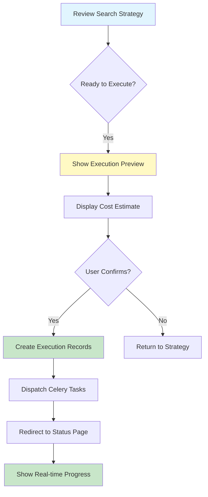

#### Story 2: Monitor Execution Progress
**As a** researcher  
**I want** to see real-time progress of my search execution  
**So that** I know the status and can intervene if needed

**Acceptance Criteria:**
- [ ] Overall progress percentage displayed
- [ ] Individual query status visible
- [ ] Results count updates live
- [ ] Error notifications immediate
- [ ] Time remaining estimation

**Technical Flow:**
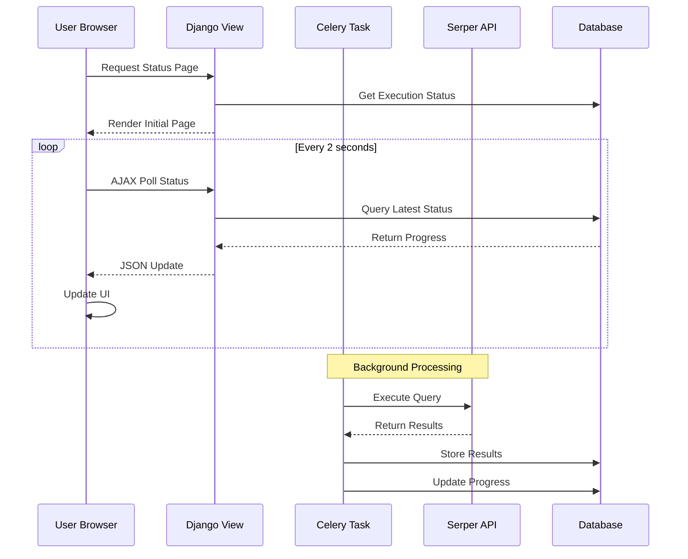

#### Story 3: Handle Search Errors
**As a** researcher  
**I want** the system to automatically recover from errors  
**So that** my search completes successfully without manual intervention

**Acceptance Criteria:**
- [ ] Automatic retry for transient errors
- [ ] Smart recovery strategies per error type
- [ ] Clear error explanations
- [ ] Manual intervention options
- [ ] No data loss on errors

**Error Recovery Flow:**
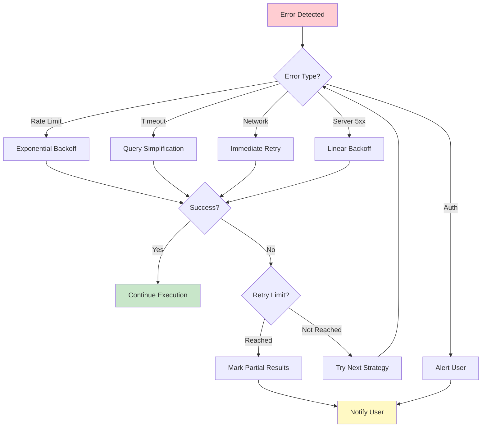

## 4. Technical Architecture

### 4.1 System Architecture
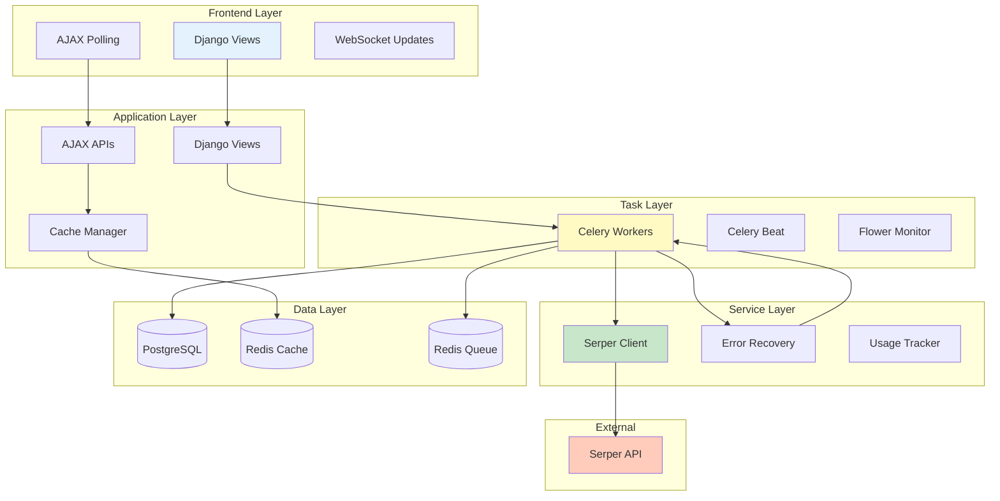

### 4.2 Component Interaction
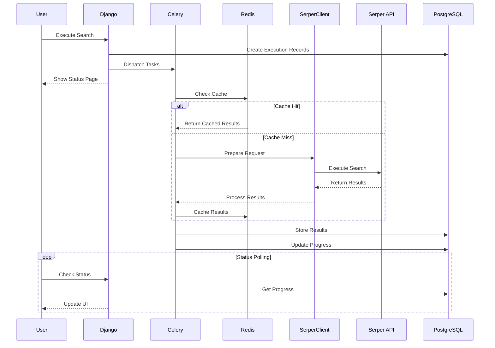

### 4.3 Database Schema
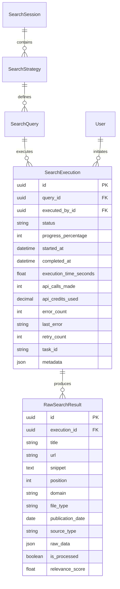

## 5. API Specifications

### 5.1 Internal AJAX APIs

#### Get Execution Status
```yaml
endpoint: /api/execution/status/{execution_id}/
method: GET
authentication: LoginRequired
response:
  type: application/json
  schema:
    status: string
    progress_percentage: integer
    status_message: string
    results_count: integer
    error_count: integer
    last_error: string
    can_retry: boolean
    estimated_completion: datetime
example:
  {
    "status": "running",
    "progress_percentage": 45,
    "status_message": "Processing query 5 of 11",
    "results_count": 127,
    "error_count": 1,
    "last_error": null,
    "can_retry": false,
    "estimated_completion": "2025-01-25T15:30:00Z"
  }
```

#### Get Session Progress
```yaml
endpoint: /api/execution/progress/{session_id}/
method: GET
authentication: LoginRequired + Ownership
response:
  type: application/json
  schema:
    session_status: string
    total_queries: integer
    completed_queries: integer
    failed_queries: integer
    total_results: integer
    total_cost: decimal
    executions: array
      - query_id: uuid
        query_string: string
        status: string
        progress: integer
        results: integer
        error: string
```

#### Retry Failed Execution
```yaml
endpoint: /api/execution/retry/{execution_id}/
method: POST
authentication: LoginRequired + Ownership
request:
  retry_strategy: string (optional)
  max_retries: integer (optional)
response:
  type: application/json
  schema:
    success: boolean
    message: string
    new_task_id: string
```

### 5.2 Serper API Integration

#### Search Request
```python
# Request to Serper API
{
    "q": "grey literature healthcare AI filetype:pdf",
    "location": "United States",
    "gl": "us",
    "hl": "en",
    "num": 100,
    "type": "search",
    "engine": "google"
}

# Response from Serper
{
    "searchParameters": {
        "q": "grey literature healthcare AI filetype:pdf",
        "num": 100,
        "type": "search"
    },
    "organic": [
        {
            "title": "AI in Healthcare: A Grey Literature Review",
            "link": "https://example.org/ai-healthcare-grey.pdf",
            "snippet": "This report examines the current state of AI...",
            "position": 1,
            "date": "2024-03-15"
        }
    ],
    "searchInformation": {
        "totalResults": "4,250",
        "timeTaken": 0.52
    },
    "credits": 1
}
```

## 6. Implementation Strategy

### Phase 1: Foundation (Week 1)
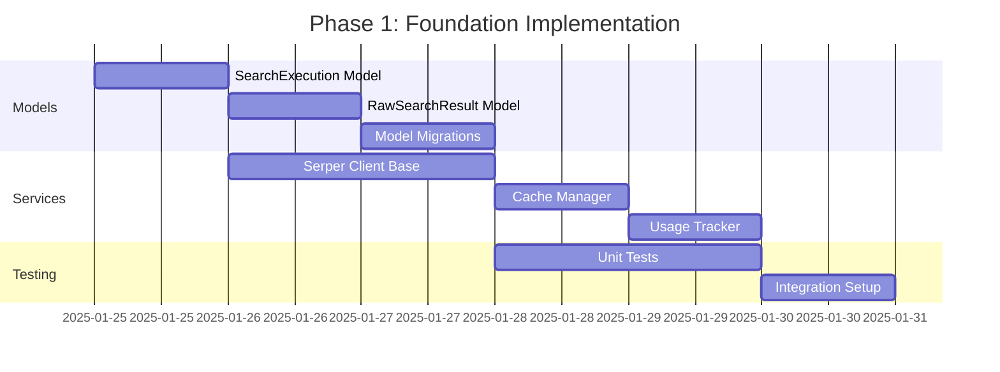

### Phase 2: Core Execution (Week 2)
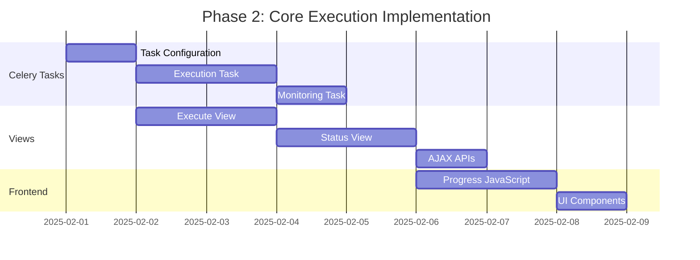

### Phase 3: Error Recovery (Week 3)
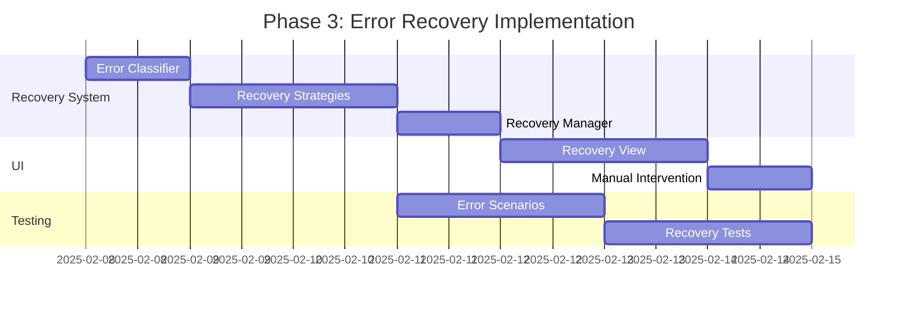

## 7. Error Handling Strategy

### 7.1 Error Classification Matrix
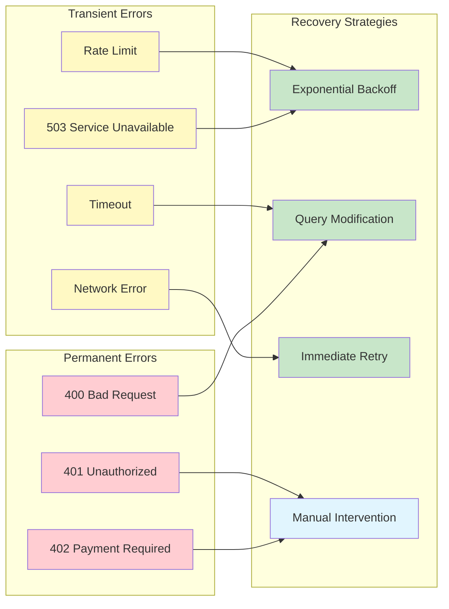

### 7.2 Recovery Implementation
```python
class ErrorRecoveryManager:
    """Intelligent error recovery with multiple strategies."""
    
    def __init__(self):
        self.strategies = {
            'rate_limit': ExponentialBackoffStrategy(),
            'timeout': QuerySimplificationStrategy(),
            'network_error': ImmediateRetryStrategy(),
            'auth_error': ManualInterventionStrategy(),
            'server_error': LinearBackoffStrategy(),
            'quota_exceeded': PartialResultsStrategy()
        }
    
    def handle_error(self, execution, error):
        """Main error handling entry point."""
        error_type = self.classify_error(error)
        strategy = self.strategies.get(error_type)
        
        if strategy and execution.can_retry():
            return strategy.apply(execution, error)
        else:
            return self.finalize_with_partial_results(execution)
```

## 8. Performance Optimization

### 8.1 Caching Strategy
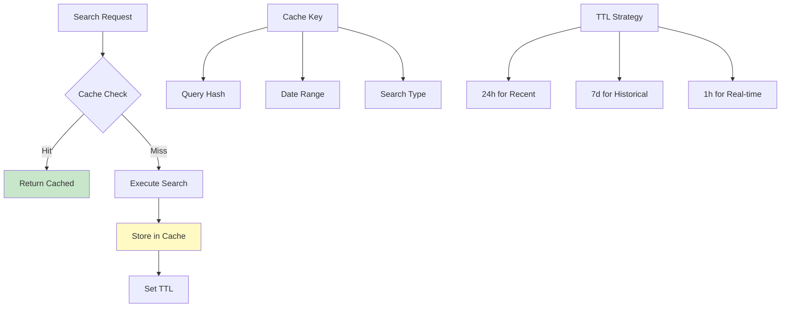

### 8.2 Batch Processing
```python
# Optimal batch configuration
BATCH_CONFIG = {
    'queries_per_batch': 10,
    'parallel_workers': 4,
    'rate_limit_per_second': 100,
    'retry_batch_size': 5,
    'result_chunk_size': 50
}
```

## 9. Security Considerations

### 9.1 API Security
- Environment variable storage for API keys
- Request signing with HMAC
- SSL/TLS enforcement
- API key rotation support
- Request/response logging (sanitized)

### 9.2 Data Security
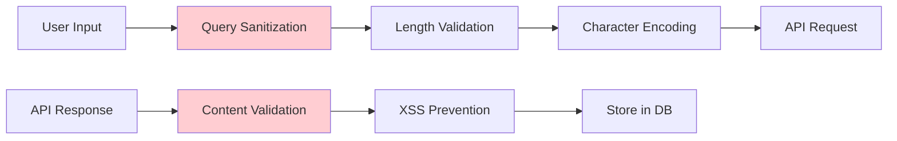

## 10. Testing Strategy

### 10.1 Test Coverage Requirements
```yaml
unit_tests:
  models: 95%
  services: 90%
  tasks: 85%
  views: 90%
  
integration_tests:
  - Complete execution workflow
  - Error recovery paths
  - Cache functionality
  - Progress tracking
  
performance_tests:
  - 1000 concurrent executions
  - Cache hit rate validation
  - API rate limit compliance
  - Database query optimization
```

### 10.2 Test Scenarios
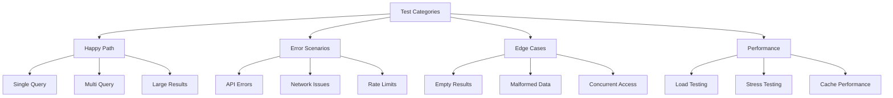

## 11. Monitoring & Analytics

### 11.1 Key Metrics Dashboard
```yaml
operational_metrics:
  - execution_success_rate
  - average_execution_time
  - error_recovery_rate
  - api_response_time
  
usage_metrics:
  - queries_per_day
  - api_credits_consumed
  - cache_hit_rate
  - cost_per_session
  
quality_metrics:
  - result_relevance_score
  - duplicate_rate
  - data_completeness
  - user_satisfaction
```

### 11.2 Alerting Rules
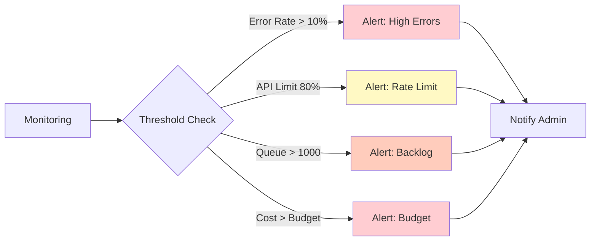

## 12. Future Enhancements

### 12.1 Advanced Features Roadmap
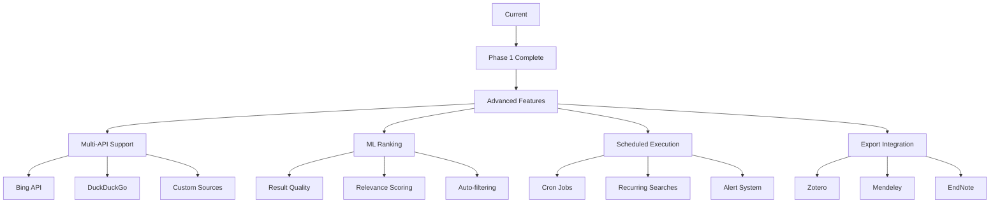

### 12.2 Scalability Considerations
- Horizontal scaling with multiple Celery workers
- Database read replicas for status queries
- CDN for static assets
- API gateway for rate limiting
- Microservice extraction for search execution

## 13. Implementation Checklist

### Week 1: Foundation ✅
- [ ] Create Django app structure
- [ ] Implement SearchExecution model
- [ ] Implement RawSearchResult model
- [ ] Create and run migrations
- [ ] Setup Serper client service
- [ ] Implement cache manager
- [ ] Create usage tracker
- [ ] Write unit tests

### Week 2: Core Features
- [ ] Configure Celery tasks
- [ ] Implement execution task
- [ ] Create monitoring task
- [ ] Build execution view
- [ ] Build status view
- [ ] Implement AJAX APIs
- [ ] Create progress JavaScript
- [ ] Style UI components

### Week 3: Polish & Recovery
- [ ] Implement error classifier
- [ ] Create recovery strategies
- [ ] Build recovery manager
- [ ] Create recovery view
- [ ] Add manual intervention
- [ ] Test error scenarios
- [ ] Performance optimization
- [ ] Documentation completion

## 14. Success Criteria

### Functional Success
- ✅ All queries execute successfully
- ✅ Real-time progress updates working
- ✅ Error recovery rate >85%
- ✅ Cost tracking accurate to $0.001

### Performance Success
- ✅ Query execution <5 seconds average
- ✅ Status updates <100ms latency
- ✅ Parallel execution efficiency >80%
- ✅ Cache hit rate >30%

### User Experience Success
- ✅ One-click execution
- ✅ Clear progress indication
- ✅ Intuitive error messages
- ✅ Accurate cost estimates

## 15. References & Resources

### Internal Documentation
- [Master PRD](../PRD.md)
- [Search Strategy PRD](../search-strategy/search-strategy-prd.md)
- [Review Manager PRD](../review-manager/review-manager-prd.md)
- [Django Project Structure](../../grey_lit_project/)

### External Resources
- [Serper API Documentation](https://serper.dev/docs)
- [Celery Best Practices](https://docs.celeryproject.org/en/stable/userguide/tasks.html)
- [Django Async Views](https://docs.djangoproject.com/en/4.2/topics/async/)
- [Redis Caching Patterns](https://redis.io/docs/manual/patterns/)

### API References
- Serper API Rate Limits: 300 queries/second
- Serper Pricing: $0.001 per query
- Redis TTL Commands
- PostgreSQL Performance Tuning

---

**Document Status:** Complete  
**Last Updated:** 2025-01-25  
**Next Steps:** Begin Phase 1 implementation with model creation