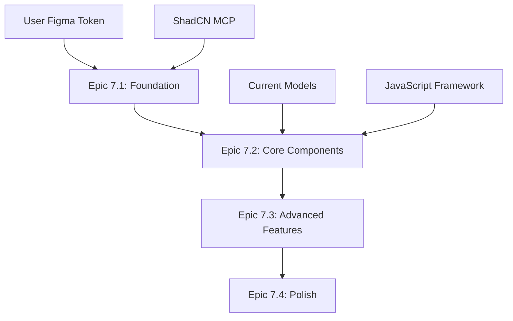

# Search Strategy UI Upgrade Implementation Plan
## Transforming to Modern Figma Design

**Goal**: Transform the current basic search strategy form into the sophisticated design shown in UI.PNG using Figma MCP and ShadCN MCP tools.

---

## 📋 **Current State Analysis**

### **Current Implementation:**
- Basic 3-textarea form (Population, Interest, Context terms)
- Simple Bootstrap cards and badges
- Basic validation with JSON term storage
- Sidebar with session info and PIC guide
- Limited visual feedback and user experience

### **Target Design (UI.PNG):**
- **Tag-based input system** with real-time tag creation
- **Real-time query preview** with syntax highlighting
- **Search domains selection** (Google Scholar, PubMed, WHO Database, etc.)
- **File type filtering** (PDF, Word documents)
- **Custom domains input** with validation
- **Strategy statistics sidebar** with comprehensive metrics
- **Workflow status tracking** with visual indicators
- **Modern design system** with consistent spacing and typography

---

## 🎯 **Implementation Plan Overview**

### **Phase Structure**: 4 Epic phases with user review checkpoints
1. **Epic 7.1**: Foundation & Design System Setup (Week 1)
2. **Epic 7.2**: Core Component Implementation (Week 2) 
3. **Epic 7.3**: Advanced Features & Integration (Week 3)
4. **Epic 7.4**: Polish & Performance (Week 4)

### **Dependencies & Prerequisites**:
- Figma MCP configured with user's access token
- ShadCN MCP server functional
- User Figma design file access
- Current search strategy app functional

---

## 🚀 **Epic 7.1: Foundation & Design System Setup**

### **Objectives**:
- Extract design specifications from Figma
- Set up component library foundation
- Create design tokens and CSS variables
- Build reusable base components

### **Tasks**:

#### **Task 7.1.1: Figma Design Analysis** (4 hours)
- **Dependencies**: User provides Figma access token
- **Deliverables**:
  - Extract color palette, typography, and spacing from Figma
  - Document component specifications (buttons, inputs, cards)
  - Map current components to target design elements
- **Review Checkpoint**: Present extracted design system to user

#### **Task 7.1.2: CSS Design System Setup** (6 hours)
- **Dependencies**: Task 7.1.1 completed
- **Deliverables**:
  - Create `apps/search_strategy/static/search_strategy/css/design-system.css`
  - Implement CSS custom properties for colors, spacing, typography
  - Create utility classes for common patterns
  - Set up component base styles
- **Review Checkpoint**: Demonstrate design tokens in isolation

#### **Task 7.1.3: Base Component Templates** (8 hours)
- **Dependencies**: Task 7.1.2, ShadCN components available
- **Deliverables**:
  - Create reusable Django template components in `templates/search_strategy/components/`
  - Implement: `tag-input.html`, `stat-card.html`, `section-header.html`
  - Create JavaScript modules for interactive components
- **Review Checkpoint**: Show working base components

### **Epic 7.1 Success Criteria**:
- [ ] Design system CSS implemented
- [ ] Base components functional in isolation
- [ ] User approval on visual direction
- [ ] Foundation ready for main features

---

## 🏗️ **Epic 7.2: Core Component Implementation**

### **Objectives**:
- Replace textarea inputs with tag-based system
- Implement real-time query generation
- Create modern form layout structure
- Add basic interactivity

### **Tasks**:

#### **Task 7.2.1: Tag-Based Term Input System** (10 hours)
- **Dependencies**: Epic 7.1 completed
- **Deliverables**:
  - Replace textareas with tag input components
  - Implement JavaScript for tag creation/deletion
  - Add term validation and visual feedback
  - Update backend to handle tag-based input
- **Review Checkpoint**: Demonstrate tag input functionality

#### **Task 7.2.2: Real-Time Query Preview** (8 hours)
- **Dependencies**: Task 7.2.1
- **Deliverables**:
  - Create query generation logic in JavaScript
  - Implement syntax highlighting for generated queries
  - Add Google Scholar and WHO Database query formats
  - Real-time updates as user types
- **Review Checkpoint**: Show live query generation

#### **Task 7.2.3: Modern Form Layout** (6 hours)
- **Dependencies**: Task 7.2.1
- **Deliverables**:
  - Recreate layout structure from Figma design
  - Implement responsive grid system
  - Add section headers and descriptions
  - Improve visual hierarchy and spacing
- **Review Checkpoint**: Compare layout to Figma design

### **Epic 7.2 Success Criteria**:
- [ ] Tag input system fully functional
- [ ] Real-time query preview working
- [ ] Layout matches Figma design structure
- [ ] User approval on core functionality

---

## 🎛️ **Epic 7.3: Advanced Features & Integration**

### **Objectives**:
- Implement search domain selection
- Add file type filtering
- Create custom domain input
- Build strategy statistics sidebar
- Integrate workflow status

### **Tasks**:

#### **Task 7.3.1: Search Domain & File Type Selection** (8 hours)
- **Dependencies**: Epic 7.2 completed
- **Deliverables**:
  - Create checkbox system for search domains
  - Implement file type selection (PDF, DOC, etc.)
  - Add custom domain input with validation
  - Update backend models to store preferences
- **Review Checkpoint**: Demonstrate selection systems

#### **Task 7.3.2: Strategy Statistics Sidebar** (6 hours)
- **Dependencies**: Task 7.3.1
- **Deliverables**:
  - Create comprehensive stats display
  - Real-time updates for term counts
  - Add search domain and query count metrics
  - Implement progress visualization
- **Review Checkpoint**: Show working statistics

#### **Task 7.3.3: Workflow Status Integration** (6 hours)
- **Dependencies**: Task 7.3.2
- **Deliverables**:
  - Create workflow status component
  - Integrate with review manager session states
  - Add visual progress indicators
  - Implement next steps guidance
- **Review Checkpoint**: Demonstrate workflow integration

### **Epic 7.3 Success Criteria**:
- [ ] All selection systems functional
- [ ] Statistics sidebar accurate and real-time
- [ ] Workflow status properly integrated
- [ ] User approval on advanced features

---

## ✨ **Epic 7.4: Polish & Performance**

### **Objectives**:
- Performance optimization
- Accessibility improvements
- Mobile responsiveness
- Final design refinements
- Testing and documentation

### **Tasks**:

#### **Task 7.4.1: Performance & Accessibility** (8 hours)
- **Dependencies**: Epic 7.3 completed
- **Deliverables**:
  - Optimize JavaScript performance
  - Add proper ARIA labels and keyboard navigation
  - Implement loading states and error handling
  - Test across browsers and devices
- **Review Checkpoint**: Performance and accessibility testing

#### **Task 7.4.2: Mobile Responsiveness** (6 hours)
- **Dependencies**: Task 7.4.1
- **Deliverables**:
  - Ensure design works on mobile devices
  - Adapt tag input for touch interfaces
  - Optimize sidebar layout for small screens
  - Test responsive behavior
- **Review Checkpoint**: Mobile testing session

#### **Task 7.4.3: Final Polish & Documentation** (6 hours)
- **Dependencies**: Task 7.4.2
- **Deliverables**:
  - Final design adjustments based on user feedback
  - Create component documentation
  - Add usage examples and guidelines
  - Performance benchmarking
- **Review Checkpoint**: Final user acceptance testing

### **Epic 7.4 Success Criteria**:
- [ ] Performance meets target metrics (<2s load time)
- [ ] Full accessibility compliance
- [ ] Mobile experience optimized
- [ ] User sign-off on final implementation

---

## 🔄 **User Review Checkpoints**

### **Checkpoint Schedule**:
1. **Epic 7.1 Complete**: Design system review and approval
2. **Epic 7.2 Complete**: Core functionality demonstration
3. **Epic 7.3 Complete**: Advanced features review
4. **Epic 7.4 Complete**: Final acceptance testing

### **Review Process**:
- Live demonstration of implemented features
- Comparison with Figma design
- User feedback collection and prioritization
- Scope adjustment if needed
- Sign-off before proceeding to next epic

---

## 📊 **Implementation Dependencies**

### **Technical Dependencies**:


### **Data Model Changes Required**:
```python
# Additional fields needed for SearchStrategy model
search_domains = models.JSONField(default=list)  # Selected search domains
file_types = models.JSONField(default=list)      # File type preferences  
custom_domains = models.JSONField(default=list)  # Custom domain URLs
ui_preferences = models.JSONField(default=dict)  # UI state persistence
```

### **New Components to Create**:
- `TagInput` - Multi-tag input with validation
- `QueryPreview` - Syntax-highlighted query display  
- `DomainSelector` - Multi-select with custom options
- `StatsCard` - Real-time statistics display
- `WorkflowStatus` - Progress indicator component

---

## 🎯 **Success Metrics**

### **Technical Metrics**:
- **Page Load Time**: <2 seconds (current: ~3-4s)
- **Tag Input Response**: <100ms (real-time feel)
- **Query Generation**: <50ms (immediate feedback)
- **Mobile Performance**: 90+ Lighthouse score

### **User Experience Metrics**:
- **Task Completion**: 95% success rate for strategy creation
- **User Satisfaction**: 4.5/5 rating on new interface
- **Feature Adoption**: 80% use of advanced features
- **Error Rate**: <2% form submission errors

### **Business Metrics**:
- **Development Time**: 4 weeks total (current estimate)
- **Code Maintainability**: Reusable component architecture
- **Future Extensibility**: Ready for Phase 2 features
- **Design System Value**: Reusable across other apps

---

## 🚀 **Next Steps After Plan Approval**

1. **User provides Figma access token**
2. **Begin Epic 7.1 with Figma design extraction**
3. **Set up development environment**
4. **Create Epic branches and project tracking**
5. **Schedule regular review meetings**

**Total Estimated Time**: 4 weeks (80 hours)
**Review Meetings**: 4 checkpoints + final acceptance
**Scope Buffer**: 10% for adjustments based on user feedback

---

*This plan transforms the basic search strategy form into a sophisticated, modern interface that matches the professional design shown in UI.PNG while maintaining the robust backend architecture already in place.*